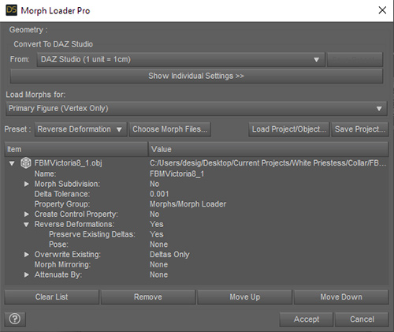
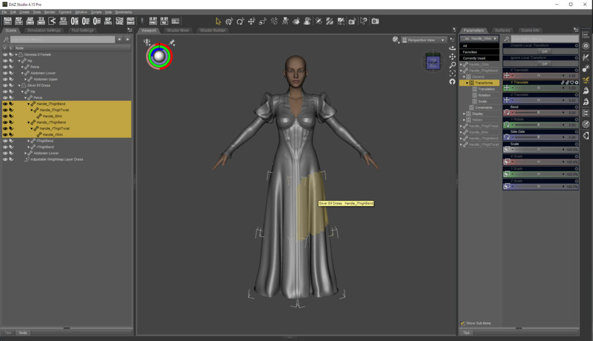

# Clothing Creation Basics
Workflow by [Mada](https://www.daz3d.com/mada)
## 01 | Basics : Workspace Daz Studio

Length : 3:32

Customize your workspace to use the same navigation/shortcuts as your modeler.

- Locate the item you want to make an action for. This can be a figure, material file, pose file, etc., as long as it is a DAZ Studio script file format.
- Right-click on the thumbnail and choose Create Custom Action from the menu. 
- Press F3 to open the Customize Daz Studio window. At the bottom, under view controls, you can change the navigation scheme to match your modeler or preferred navigation method.
- My preferred scheme:
  - Alt + Left Mouse button: orbit
  - Alt + Middle Mouse button: Pan

### Shortcut Keys

- Alt+Shift+W = weight map brush
- Alt+Shift+J = joint editor

## 02 | Basics : Reverse Deformation (MLP)

Length: 0:58

Follow the video to set up a preset in Morph Loader Pro that you can load for future use.

### Morph Loader Pro settings to use for JCMs and FBMs

- Reverse Deformations : Yes
- Overwrite Existing: Deltas only.
  *(if there’s no existing morph, a new one will be created even if you have deltas only selected)*

## 03 | Basics : Creating ERC Morphs

Length : 2:37

- Export an obj of your clothing item from Daz Studio with resolution set to base. Create your morph/fix and import it into Daz Studio with Morph Loader Pro.
- Find your morph in the parameters tab, click on the gear icon in the top right corner, and select parameter settings. Change min from -100% to 0%. Click accept and dial-up your morph.
- Right-click anywhere in the parameters tab and select edit mode.
- Click on the body part affected by the morph (i.e., left thigh) and make sure you have the clothing item left thigh selected, find the parameter used (i.e., bend), and right-click on the dialed up morph select ERC Freeze from the popup menu. Tick only the box next to the morph; everything else must be unselected. Click accept.

*NOTE: Click the gear next to Fit to Mode on the parameters tab for the clothing item and select parameter settings. Set both Default and Value to Auto Follow Transforms and click accept. Select the hip on your clothing item and make sure limits are set to OFF in the X, Y, and Z Rotate.*

## 04 | Basics: Multi-Dimensional Property Morph

Length : 2:06
Use the Multi-Dimensional Property Setup script to add a JCM that only activates when you use two body parts together.

- Bend both body parts to where you want them to be in the final position; for example, both legs bent to -90
- Create a morph that changes the look to what you want and fix any problems that occur when you have the two body parts working together
- Import your morph with reverse deformations on; DS will create the morph if it doesn’t already exist, so it doesn’t matter if Deltas Only is selected.
- Find the morph you just imported, open the parameter settings and change the Min to 0%
- Tick the Use Limits box and click accept
- Dial your morph to 100%
- With the item selected in the Scene tab (highlighted), also select the two body parts while holding down the shift or control key. In my video, I have the Pants selected and the Left Thigh Bend and the Right Thigh Bend.
- Now go to currently selected on the parameter tab and select the rotation used (in this case bend), making sure to use shift or control to end up with the following items selected.
  - Scene tab: Pants, left and right thigh.
  - Parameter tab: Bend
- Run the script, find your morph on the drop-down under Result Property, select it, and click accept
- Zero out both body parts, dial them separately, and check under currently selected that the new morph is not activating; it should only activate when both body parts are moving

## 05 | Basics : Creating control bones

Load an outfit into Daz Studio. In my example, I’m using a long dress and adding control bones to the thighs and shins

- Select the Joint Editor tool and click on the Left Thigh Bend in the scene tab
- Right-click on the viewport
  - Create | Create Control Bone(s)
- I change the prefix from cb_ to Handle_ to make it clearer in usage.
  - Mode | Selected and Children
- Duplicate steps for the Right Thigh Bend
- Select the bones you don’t want to be visible in the scene view.
  - Handle_lFoot, Handle_lMetatarsals, Handle_lToe
  - Joint Editor Tool | Tool Settings | Hide in Scene View(s) should have a checkmark
- Duplicate steps for right leg
- Click on Handle_Left_Thigh in the scene tab and go to tool settings for the Joint Editor Tool.
- On the Selection Group dropdown, find the different body parts you have selected and tick the box to change the Assigned Bone.
  - select Handle_lShin | tick box for lShin
  - select Handle_lThigh | tick box for lThigh
  - select Handle_rShin | tick box for rShin
  - select Handle_rThigh tick box for rThigh
- Now when you click on the figure's thigh, it will select the dress thigh, and you can adjust it as needed; handy to fix poke throughs, especially when the thighs bend in too much on the figure

## 06 | Basics: Setting up KeyERC with an animated timeline