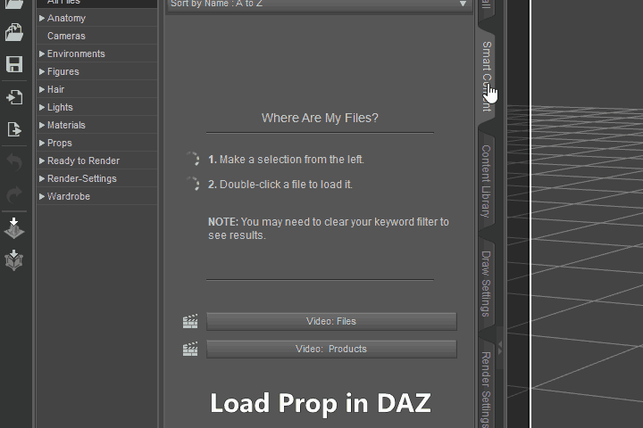
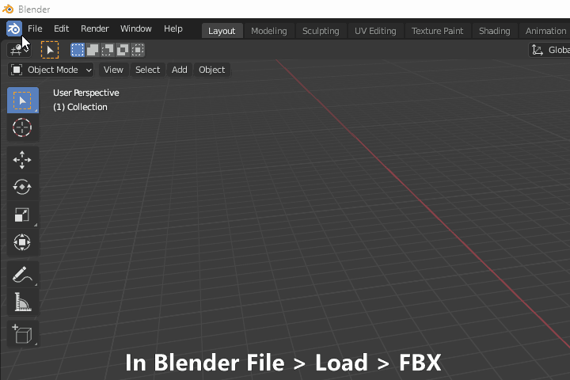
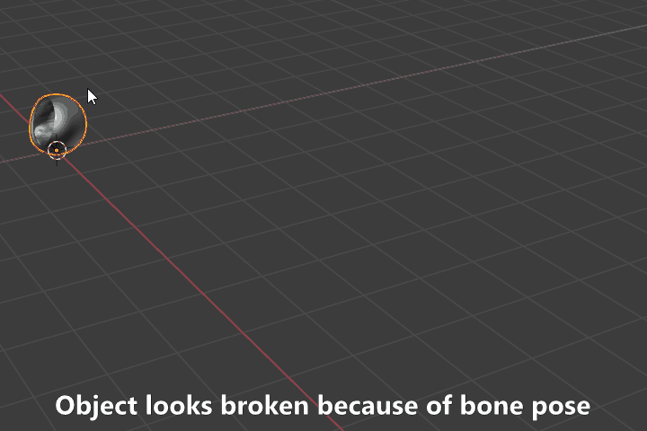
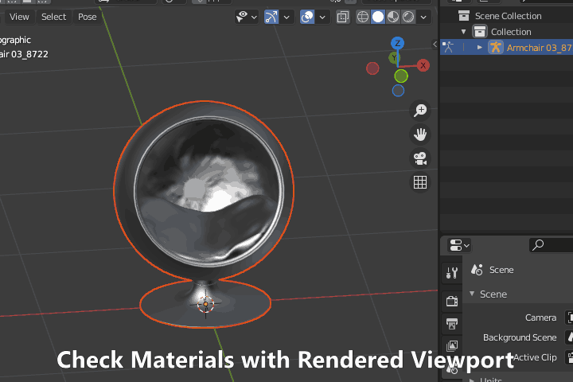
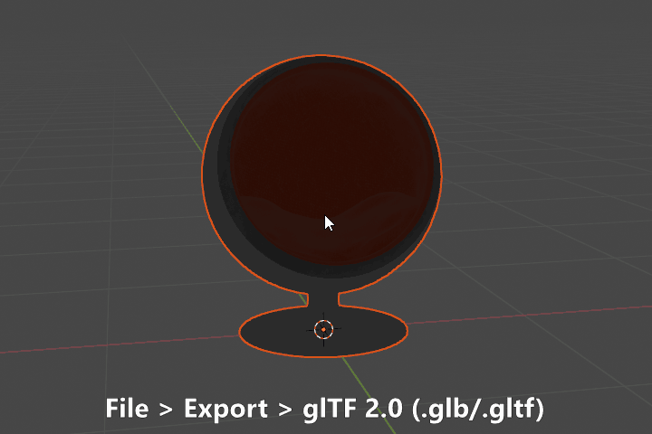

# Converting a Daz Prop to glTF using Blender
glTF is a fast and highly compressed 3D format used in games, 
native web applications, AR, VR, and 3D ads. 
You can also embed glTF files in Microsoft Word documents or PowerPoint files.

## Save prop as FBX with Embed Textures
* Load Prop in Daz Studio
* Export as FBX
* Embed Textures checked
<figure markdown>
  { width="720" }
</figure>

## Import FBX into Blender
* File > Import > *.fbx
* Standard Settings
<figure markdown>
  { width="720" }
</figure>

## Reset the Bone Pose
* Change to pose mode 
* Alt + R to reset bones
* Alt + A to Apply as rest pose 
<figure markdown>
  { width="720" }
</figure>

## Check Material is loaded
* Materials should be embedded from the Daz FBX export. 
* Viewport shading to rendered
<figure markdown>
  { width="720" }
</figure>

##Export GLTF (file extension .GLB)
* File > Export > glTF 2.0 (.glb/.gltf)
<figure markdown>
  { width="720" }
  <figcaption>Export Complete!</figcaption>
</figure>
